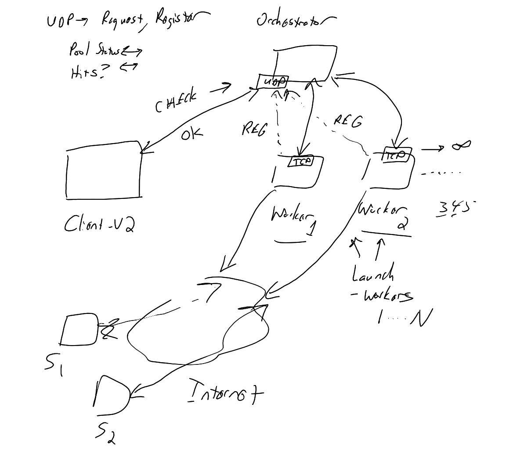

# Coding Project 1 - Part 2

## General Overview

In the first part, you gained experience working with TCP and C / C++.  In this second part, we are going to add in support for UDP along with the concept of an orchestrator (coordinator).  The worker (server) will also get an upgrade (potentially) and you will have the chance to incorporate various optimizations to the code base.

## Task Overview

Good news! The core product for your employer has taken off and is doing extremely well so the advertising budget is increasing by an order of magnitude.  The bad news is that we need to significantly increase the number of workers as a single worker is not going to be sufficient. To that end, the brilliant senior architect had a vision: Let's use UDP and an orchestrator with a batch system so we can effectively have as many workers as we would like.

Your job in Part 2 is to make that happen. The senior architect shares a napkin sketch of the proposed system:



The following properties are noted:

* The new client (version 2.0) will send a UDP message to the orchestrator for each request / try. Each message signifies one request to be completed by the workers. The format will be the same as the original client messaging.
   * Since the results get queued, the reply message will always be 200 OK if things are working.
* The orchestrator will queue those requests and then send any requests out to any idle workers.
* Workers will register themselves with the orchestrator as being willing to take on work providing their IP address and port number to the orchestrator, also using a UDP message.
   * Workers (the original server) will now take in additional arguments including their IP address, the IP address of the orchestrator, the port number of the orchestrator, and the identity of the worker.
* Logging will take place as normal but each worker will have its own log directory to avoid race conditions.
* There will also be more more client scripts to be written
   * A client script to note the status of workers in the pool.  This is largely for debugging purposes.
   * A client script that gets the last N "hits" where the advertising string was detected (N can be a maximum of five) noting the site, time, and worker ID
   * A launch script that starts up to N workers on a machine.

Being an outstanding new junior hire, you are also requested to come up with at least one optimization per group member to improve the overall system performance and / or add in an appropriate feature

## Distilling the Task

Your code should be organized as follows:

* Create a new directory named `cp1-part2` where your code for Part 2 will be placed.  This will allow us to test your Part 1 submission.
   * You can and should copy over your code from Part 1 to this directory
* All commits for Part 2 should start with `cp1-part2` followed by your actual commit message.

Similar to Part 1, you have a fair degree of freedom with respect to how you go about the project subject to the following design limitations:

* You will use the same port range (54000-54150) and to connect, you will need to either be on the student machine or connected via the campus VPN.
* For the orchestrator, you may use either Python or C / C++. The orchestrator will use only a single shared UDP port for simplicity and will follow the request / reply paradigm (e.g. either the client or the worker will request).  All messages will be presumed to "fit" within a single UDP datagram (1400 bytes).
   * If a message format is undefined, think ASCII and state your assumptions in the `README.md`.
* The startup for the original server (worker) will necessarily change. The first two arguments will remain the same resulting in the following argument list:
   * The port number for the worker (server) - same as before
   * The location for the logs for that worker - same as before
   * The IP address (hostname) for the worker (server)
      * It can a bit tricky to get one's own IP address - this step simplifies that part.  This will be used by the orchestrator when reaching out to the worker.
   * The IP address (hostname) for the orchestrator
   * The port number for the orchestrator
   * The identifier for the worker (contiguous string)
* You may use either Python or C / C++ for the new scripts including:
   * A new script named `client-v2.py` that provides the same functionality as appropriate from Part 1 but now sends a UDP message for each request. You are welcome to modify `client.py` as you see fit.
   * A new script named `pool-status` (or `pool-status.py`) that lists information about each worker in the pool including: the identifier, the IP address (hostname), the port, the last time a job was sent, and the last time a result was received. It should take in as arguments the hostname for the orchestrator and the port number for the orchestrator as its first and second arguments.
   * A new script named `check-hits` (or `check-hits.py`) that provides information about the last `N` hits that triggered an image fetch where `N` is at most five.  It should provide a list (one per line) that includes: the worker identifier string, the site identifier, the advertising string, and the time of the fetch.
   * A new script named `launch-workers` that launches `N` workers. It should take in the number of workers (up to five) and appropriately ensure that logging directories are present and to start up the workers pointing to the orchestrator. The script should take in five arguments: the orchestrator IP / hostname, the port number for the orchestrator, the IP address to state for the workers, the starting port number for the workers, and the number of workers to launch.

For compatibility purposes, the format of the message from the worker to the orchestrator should be as follows:

```
REGISTER Hostname Port Identifier
```

where `Hostname` can be an IP address or hostname, `Port` should be an integer string where inbound TCP connections are accepted, and `Identifier` should be a reasonable length contiguous string that is unique for that worker instance.

## Notes / Comments

Similar to Part 1 but even to a larger extent, you have a significant degree of freedom in terms of how the respective client scripts interact with the orchestrator. You also have significant freedom with regards to how the orchestrator interacts with the workers.  A few comments:

* If you are happy with your Part 1 code, it would be plausible for the orchestrator to `fork` a child that effectively runs the original client code to connect to the worker.
* It will likely be advantageous to have each worker have its own log directory to avoid race conditions.  You could create sub-directories whose content is not pushed to your `git` repo underneath the `cp1-part2` directory, e.g. `cp1-part2/worker-001`.
* One aspect that will require careful navigation will be how to track / know when hits have been detected.
* If your orchestrator crashes, it likely means that you will need to destroy each of your workers.
* If you disliked your C or C++ code from Part 1, you may rewrite the worker portion in Python.

## Optimization / Features

For each member of the group, each member is responsible for one substantive feature / optimization beyond the core specification.  Examples include:

* Create a mechanism whereby only certain clients are allowed to connect (e.g. restrict the range of valid IP addresses)
* Create a mechanism whereby only certain workers are allowed to join the pool
* Create a mechanism whereby the identifier is a secure token that is validated for connection
* When an image is downloaded and has been seen recently, do not save the image again but instead save a marker or note that either is a symlink or maps back to the first download
* Write a script that indexes all log files to determine if any hits were detected and / or add specific functionality to the script for filtering purposes
* Allow `launch-workers` to be interactive whereby the user can type `ADD` or `REDUCE` to increase or decrease the number of running workers
* Add in a heartbeat that allows the orchestrator to check if a worker is still alive via a new message exchanged between the orchestrator and the worker

Document in your `README.md` the specific feature, who implemented / built the feature, and how to test / confirm operation of the feature.  The list above is not exhaustive but is there to help inspire you as to interesting add ons.

## Submission

* Create a `README.md` file inside of `cp1-part2` containing instructions on how to run your code as well as identifying the contributions from each member of the group.   There should be at least one `Makefile` to compile your C or C++ code.
   * Note that each member of the group should have at least one substantial commit.
* Push your code to Github and submit the full hash of your submission via Canvas. Note that only one member needs to submit the hash.

## Rubric

To be added later in the week